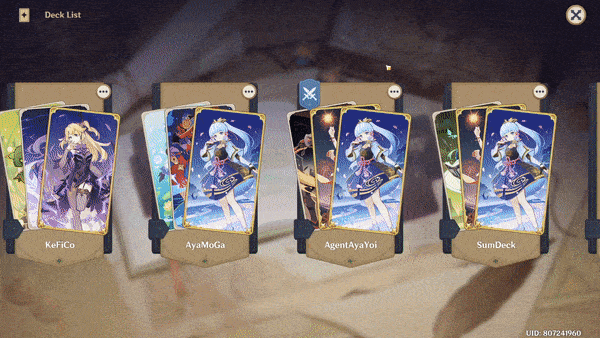

# Genshin TCG Deck Scanner

Implementation of Contend-Based Image Retrieval (CBIR) to extract data from Genshin Impact generated Genius Invokation TCG image

## [Demo](https://jogerj.github.io/genshin-tcg-cbir/)

## Extracting deck data

1. To generate image, go to the deck in Casket of Tomes, select the "..." menu -> "Preview Deck" -> "Share" -> "Save". The image will be stored in your ScreenShots folder. See [samples](samples) folder for examples.
   
   

2. Run the following:
   - Python 3:

     ```sh
     cd python
     python generate_json.py -q path/to/image.png -r ../images
     ```

   - In web browser:

     ```sh
     cd js/genshin-tcg-cbir
     npm run start    # run demo in browser
     ```


## Indexing more cards

Should the game be updated with more cards, add them to the respective [directory](images) and rerun the following to reindex all cards:

```sh
cd python
python indexer.py --dataset ../images/characters --index characters_index.csv
python indexer.py --dataset ../images/actions --index actions_index.csv
```
or
```sh
cd js/genshin-tcg-cbir
npm run index    # run once to index all
```

Index files generated in Python and Node.js are incompatible with each other, so generate them separately.

## License

[MIT](LICENSE)

This project is not affiliated with HoYoVerse. Genshin Impact, game content and materials are trademarks and copyrights of HoYoVerse.
